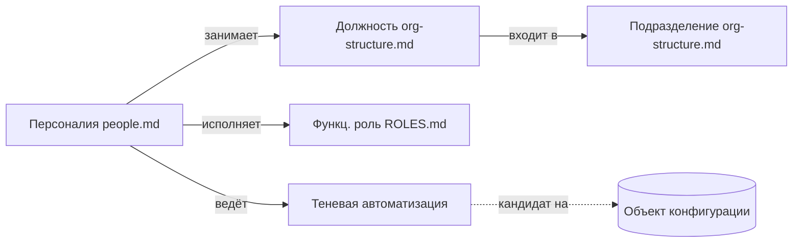

# Формат реестров аналитики

Реестры в `docs/analytics/` у потребителя — **знания об организации**: кто есть
кто, штатка, процессы вне конфигурации 1С. Наполняются в
[/explore](../../cursor/skills/explore/SKILL.md). Это не домен-лексика
(`CONTEXT.md`) и не функциональные роли (`ROLES.md`).

Назначение: кто постановщик, какое подразделение затронуто, какой «эксель»
кандидат на автоматизацию.

## Три реестра

| Файл | Сущность | Что описывает |
| --- | --- | --- |
| `org-structure.md` | **Должность**, **Подразделение** | Дерево штатки |
| `people.md` | **Персоналия** | Человек → должность → роли → артефакты |
| `shadow-automation.md` | **Артефакт теневой автоматизации** | Процессы вне 1С (эксель, ручные операции) |

Индекс каталога: `docs/analytics/README.md`. Файлы реестров — у потребителя,
не в kit.

## Граница понятий (не путать)

- **Персоналия** — конкретный человек. Реестр `people.md`.
- **Должность** — позиция в штатке. Реестр `org-structure.md`.
- **Функциональная роль** — что человек делает по процессу. `ROLES.md`.
  Роль ≠ должность: один человек носит N ролей.
- **Артефакт теневой автоматизации** — работа вне 1С. `shadow-automation.md`.
- **Домен-термин** — понятие предметной области. `CONTEXT.md`.

## Связи между реестрами

Запись ссылается на другую **по имени**:

Инвариант: имя из записи существует в целевом реестре (или `неизвестно` / `TODO`).

## Когда создавать / дополнять

- **Лениво**: при первом упоминании сущности в /explore.
- **Inline**: не батчить «на потом».
- **Эволюция**: уточнять свободно; объединять/разделять — с оператором
  ([ROLES-FORMAT.md](ROLES-FORMAT.md) § Эволюция).

## Поля записи

### org-structure.md — Должность / Подразделение

- **Заголовок** — каноничное имя.
- `_Тип_` — `подразделение` / `должность`.
- Одно предложение — функция.
- `_Входит в_` (опц.) — родительское подразделение.
- `_Avoid_` / `_Статус_` — как в ролях.

### people.md — Персоналия

- **Заголовок** — ФИО (канон одного человека).
- `_Должность_` — ссылка на `org-structure.md`.
- `_Роли_` — ссылки на `ROLES.md`.
- `_Артефакты_` (опц.) — ссылки на `shadow-automation.md`.
- `_Статус_` — `согласовано` / `предположено`.

### shadow-automation.md — Артефакт

- **Заголовок** — короткое имя процесса.
- Одно-два предложения — что делает, где живёт.
- `_Владелец_` — `people.md`.
- `_Боль_` — риск, дубль, ручной труд.
- `_Кандидат на_` (опц.) — какой объект конфигурации закрыл бы.
- `_Статус_` — `согласовано` / `предположено`.

## Статусы

- **согласовано** — оператор подтвердил.
- **предположено** — агент догадался, ждёт подтверждения.

## Копирайт

Из [ROLES-FORMAT.md](ROLES-FORMAT.md) и [CONTEXT-FORMAT.md](CONTEXT-FORMAT.md)
(база — mattpocock/skills, MIT). Навык: [/explore](../../cursor/skills/explore/SKILL.md).
Раскладка: [docs-layout.md](docs-layout.md).
